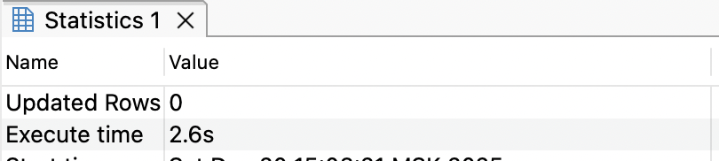

## Задание 3

1. Создайте таблицу с большим количеством данных:
    ```sql
    CREATE TABLE test_cluster AS 
    SELECT 
        generate_series(1,1000000) as id,
        CASE WHEN random() < 0.5 THEN 'A' ELSE 'B' END as category,
        md5(random()::text) as data;
    ```

2. Создайте индекс:
    ```sql
    CREATE INDEX test_cluster_cat_idx ON test_cluster(category);
    ```

3. Измерьте производительность до кластеризации:
    ```sql
    EXPLAIN ANALYZE
    SELECT * FROM test_cluster WHERE category = 'A';
    ```
    
    *План выполнения:*
    Bitmap Heap Scan on test_cluster  (cost=59.17..7696.73 rows=5000 width=68) (actual time=27.694..183.593 rows=499640 loops=1)
    Recheck Cond: (category = 'A'::text)
    Heap Blocks: exact=8334
    ->  Bitmap Index Scan on test_cluster_cat_idx  (cost=0.00..57.92 rows=5000 width=0) (actual time=26.103..26.104 rows=499640 loops=1)
            Index Cond: (category = 'A'::text)
    Planning Time: 0.428 ms
    Execution Time: 211.632 ms
    
    *Объясните результат:*
    Bitmap Heap Scan проверяет 8334 блока (exact), т.к. данные не упорядочены по category. Большое время из-за случайного доступа к heap.

4. Выполните кластеризацию:
    ```sql
    CLUSTER test_cluster USING test_cluster_cat_idx;
    ```
    
    *Результат:*
    

5. Измерьте производительность после кластеризации:
    ```sql
    EXPLAIN ANALYZE
    SELECT * FROM test_cluster WHERE category = 'A';
    ```
    
    *План выполнения:*
    Index Scan using test_cluster_cat_idx on test_cluster  (cost=0.42..14666.42 rows=501600 width=39) (actual time=0.093..135.739 rows=499640 loops=1)
    Index Cond: (category = 'A'::text)
    Planning Time: 0.658 ms
    Execution Time: 166.088 ms
    
    *Объясните результат:*
    Index Scan вместо Bitmap Heap Scan: данные физически упорядочены по индексу, последовательное чтение эффективнее.

6. Сравните производительность до и после кластеризации:
    
    *Сравнение:*
    Кластеризация ускорила запрос на ~21% (211.6 → 166.1 мс). План изменился с Bitmap Heap Scan на Index Scan благодаря физической упорядоченности данных.